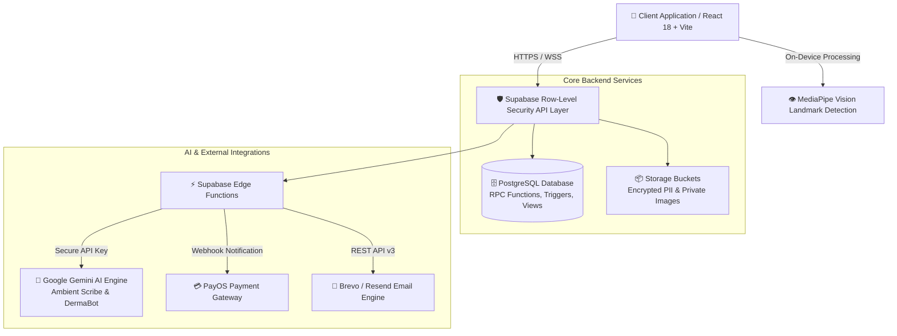

[](https://classroom.github.com/a/r92bbHwx)

<div align="center">

# 🩺 DermaSmart — Dermatology Clinic Management System

### *Hệ thống Quản lý Phòng khám & Thẩm mỹ Da liễu Thông minh Tích hợp Trí tuệ Nhân tạo*

[](https://reactjs.org/)
[](https://vitejs.dev/)
[](https://tailwindcss.com/)
[](https://supabase.com/)
[](https://deepmind.google/technologies/gemini/)
[](https://mediapipe.dev/)
[](https://payos.vn/)

</div>

---

## 📌 Tổng quan Dự án

**DermaSmart** là nền tảng quản lý phòng khám da liễu toàn diện thế hệ mới, được thiết kế nhằm tối ưu hóa toàn bộ quy trình vận hành y tế từ tiếp đón, phân luồng bệnh nhân, chẩn đoán y khoa, thực hiện thủ thuật đến quản lý tài chính và chăm sóc sau khám. 

Hệ thống tiên phong ứng dụng **Trí tuệ nhân tạo (AI)** và **Thị giác máy tính (Computer Vision)** giúp giảm thiểu đến 70% thời gian nhập liệu thủ công cho y bác sĩ, nâng cao độ chính xác trong chẩn đoán lâm sàng và mang lại trải nghiệm khám chữa bệnh hiện đại, minh bạch cho khách hàng.

---

## 🌟 Điểm sáng Đột phá & Giải pháp Công nghệ



### 1. 🎙️ AI Ambient Scribe (Trợ lý Kê đơn & Bệnh án Tự động)
*   **Cơ chế hoạt động**: Tự động chuyển đổi hội thoại ghi âm hoặc văn bản trực tiếp giữa Bác sĩ và Bệnh nhân thành **Bệnh án điện tử (EMR)** chuẩn y khoa.
*   **Trí tuệ nhân tạo**: Sử dụng mô hình **Google Gemini** chạy trên nền tảng Supabase Edge Functions để phân tích ngữ cảnh y học, tự động trích xuất:
    *   Triệu chứng lâm sàng (Subjective / Objective findings).
    *   Đề xuất chẩn đoán y khoa kèm mã chuẩn hóa **ICD-10**.
    *   Gợi ý phác đồ điều trị và đơn thuốc dự kiến với liều lượng chuẩn.
*   **Bảo mật dữ liệu**: API Key được lưu trữ hoàn toàn tại Supabase Secrets; không lộ thông tin nhạy cảm ở phía Client.

### 2. 🔬 Soi da Mặt AI Real-time (Computer Vision + LLM Multimodal)
*   **Định vị khuôn mặt trên thiết bị (On-Device)**: Tích hợp `@mediapipe/tasks-vision` phát hiện vạch chuẩn khuôn mặt (Landmark detection) ngay trên trình duyệt bệnh nhân trước khi tải ảnh.
*   **Phân tích đa thức**: Kết hợp thuật toán phân tích màu sắc ma trận ảnh và Gemini Multimodal Vision để nhận diện các chỉ số tình trạng da (Mụn trứng cá, mụn mủ, thâm nám, lỗ chân lông, nếp nhăn, loại da).
*   **Bảo mật lưu trữ**: Hình ảnh soi da được lưu tại Private Bucket (`skin-scans`) và chỉ được cấp quyền truy cập qua đường dẫn có thời hạn (Signed URLs). Tự động giới hạn lưu trữ 4 lượt quét gần nhất để tối ưu tài nguyên.

### 3. 🔒 Giao dịch Đặt lịch Khóa slot Nguyên tử (Atomic Concurrency Control)
*   **Chống tranh chấp tài nguyên (Anti-Race Condition)**: Sử dụng các thủ tục lưu trữ **PL/pgSQL RPC (`hold_appointment_slot`)** để xử lý khóa slot khám nguyên tử (Atomic locking) trong vòng 5 phút khi bệnh nhân tiến hành thanh toán cọc.
*   Tránh tuyệt đối tình trạng hai người dùng đặt trùng một khung giờ của cùng một bác sĩ tại cùng một thời điểm.

### 4. 🛡️ Kiến trúc Bảo mật Phân quyền RLS 5 Lớp (Multi-Tenant Security Architecture)
*   Tất cả dữ liệu bệnh lý, hóa đơn, lịch họp và đơn thuốc đều được bảo vệ bởi **Row-Level Security (RLS)** ở cấp độ bảng Database.
*   Dữ liệu tài chính và PII (thông tin cá nhân nhạy cảm) được cách ly strictly theo vai trò tài khoản (`role_id`).

---

## 🛠️ Công nghệ Cốt lõi (Tech Stack)

| Phân tầng | Công nghệ / Thư viện | Vai trò & Đặc điểm |
| :--- | :--- | :--- |
| **Frontend Framework** | **React 18** + **Vite 5** | Xây dựng Single Page Application (SPA) tốc độ cao, render linh hoạt. |
| **Styling & UI** | **Tailwind CSS** + **Framer Motion** | Thiết kế giao diện theo phong cách Modern Glassmorphism (Kính mờ), chuyển cảnh mượt mà. |
| **Iconography** | **Lucide React** | Bộ biểu tượng y tế chuẩn hóa, nhất quán. |
| **Database & Auth** | **Supabase (PostgreSQL 15+)** | Quản lý cơ sở dữ liệu quan hệ, Auth JWT, Realtime Subscriptions & RLS. |
| **Edge Computing** | **Supabase Edge Functions (Deno)** | Xử lý tác vụ tính toán nặng, giao tiếp API bên thứ 3 an toàn. |
| **AI & Computer Vision** | **Google Gemini API** + **MediaPipe** | Trợ lý ngôn ngữ y khoa, xử lý ảnh soi da khuôn mặt. |
| **Payment Gateway** | **PayOS API** | Cổng thanh toán mã QR ngân hàng tự động đối soát tiền cọc/hóa đơn. |
| **Transactional Email** | **Brevo API (v3) / Resend** | Gửi email xác nhận lịch khám và hóa đơn điện tử tự động. |

---

## 📋 Phân hệ Tính năng Chi tiết (5 Vai trò Người dùng)

### 1. 👤 Bệnh nhân (Patient Portal & Public Services)
*   **Đặt lịch khám thông minh**: Tìm kiếm bác sĩ theo chuyên khoa, chọn ngày/khung giờ và dịch vụ. Hỗ trợ cả bệnh nhân có tài khoản và **Khách vãng lai (Guest Booking)**.
*   **Soi da mặt AI miễn phí**: Tải ảnh chụp khuôn mặt để nhận báo cáo phân tích da chi tiết và khuyến nghị bác sĩ phù hợp.
*   **Trợ lý ảo DermaBot**: Chatbot tự động tư vấn dịch vụ, bảng giá, giờ làm việc và hỗ trợ chuyển tiếp cuộc trò chuyện cho Lễ tân khi cần.
*   **Cổng Hồ sơ Cá nhân (Profile Portal)**: Theo dõi lịch sử khám bệnh, kết quả xét nghiệm/thủ thuật, đơn thuốc và lịch sử phản hồi dịch vụ kèm phân trang mượt mà (`GlassPagination`).

### 2. 👨‍⚕️ Bác sĩ (Doctor Clinical Workspace)
*   **Bảng điều khiển Tổng quan (Dashboard)**: Theo dõi danh sách bệnh nhân chờ khám trong ngày, số ca đã hoàn thành và tổng số giờ làm việc theo tuần.
*   **Bệnh án Điện tử (Virtual Clinic EMR Workspace)**:
    *   Xem tiền sử bệnh lý, chỉ số sinh hiệu (Vitals) và ghi chú dị ứng thuốc của bệnh nhân.
    *   Tích hợp công cụ **AI Ambient Scribe** hỗ trợ tạo bản nháp bệnh án tự động.
    *   Kê đơn thuốc từ danh mục thuốc quốc gia, thiết lập liều dùng và lời dặn tái khám.
    *   Ra **Chỉ định Kỹ thuật (Service Tickets)** chuyển trực tiếp cho phòng Kỹ thuật viên.
*   **Tự động Lưu nháp (EMR Auto-Save & Restore)**: Tự động ghi nhớ dữ liệu nhập dở dang vào bộ nhớ cục bộ để bác sĩ không bị mất thông tin khi chuyển đổi ứng dụng.

### 3. 👩‍💼 Lễ tân (Receptionist Desk)
*   **Quản lý Hàng đợi & Tiếp đón**: Tiếp nhận bệnh nhân đăng ký trước hoặc khách vãng lai (Walk-in), xếp hàng đợi khám tự động.
*   **Thanh toán & Thu phí (Billing & Checkout)**: Quản lý hóa đơn dịch vụ, tính toán chi phí khám + chỉ định cận lâm sàng, hỗ trợ áp mã giảm giá (Voucher) và tạo mã QR PayOS thanh toán tức thì.
*   **Tổng đài Trực tuyến (Live Chat Center)**: Tiếp nhận các phiên chat chuyển giao từ DermaBot để tư vấn trực tiếp cho khách hàng.

### 4. 💆‍♀️ Kỹ thuật viên (Technician Operation Queue)
*   **Hàng đợi Thực hiện Thủ thuật**: Xem danh sách chỉ định kỹ thuật (trị mụn, chăm sóc da, chiếu laser...) được bác sĩ gửi sang.
*   **Cập nhật Tiến độ & Kết quả**: Tải ảnh chụp kết quả trước/sau trị liệu, nhập ghi chú kỹ thuật và đánh dấu hoàn thành để trả dữ liệu về bệnh án bác sĩ.

### 5. 🛠️ Quản trị viên (Admin Management & Analytics)
*   **Quản lý Nhân sự (Employee Management)**: Tạo mới, cập nhật thông tin và quản lý trạng thái hoạt động (Active/Suspended/Locked) của Bác sĩ, Lễ tân, Kỹ thuật viên.
*   **Phân công Lịch trực (Schedule Assignment)**: Giao diện kéo thả xếp ca làm việc trực quan cho nhân sự theo tuần/tháng (`DoctorScheduleManagement`).
*   **Báo cáo & Thống kê Doanh thu (Analytics & Reports)**:
    *   Biểu đồ doanh thu chi tiết theo Ngày, Tuần, Tháng, Quý, Năm với bộ lọc thời gian nâng cao (`useAdvancedTimeFilter`).
    *   Nhật ký hệ thống (System Logs) và thống kê hiệu suất khám chữa bệnh.
*   **Quản lý Bảng giá & Voucher**: Thiết lập danh mục dịch vụ y tế, kho thuốc và tạo các mã khuyến mãi theo phần trăm/số tiền cố định.

---

## 📂 Cấu trúc Thư mục Dự án (Project Directory Structure)

```
Dermatology_Clinic_Management_System/
├── docs/                        # Tài liệu đặc tả yêu cầu & kịch bản kiểm thử (Selenium test scripts)
├── scripts/                     # Các kịch bản nạp dữ liệu mẫu ban đầu (Seeding scripts)
│   ├── seed_static_data.mjs     # Khởi tạo danh mục Dịch vụ, Thuốc, Vouchers tĩnh
│   └── seed-test-data.mjs       # Khởi tạo tài khoản nhân sự (Bác sĩ, Lễ tân, KTV) thử nghiệm
├── supabase/
│   ├── config.toml              # Cấu hình dự án Supabase CLI
│   ├── functions/               # Supabase Edge Functions (Serverless Deno TypeScript)
│   │   ├── ambient-scribe/      # Processing audio/text EMR draft via Gemini
│   │   ├── chat-bot/            # DermaBot NLP query engine
│   │   ├── payos/               # PayOS payment link creation & webhook receiver
│   │   └── send-clinic-email/   # Transactional email service (Brevo v3 / Resend)
│   └── migrations/              # SQL Scripts khởi tạo Schema, Triggers, RLS & RPC Functions
├── src/
│   ├── components/              # Các UI Components phân chia theo miền nghiệp vụ
│   │   ├── Admin/               # Quản lý nhân sự, lịch trực, doanh thu, báo cáo
│   │   ├── Doctor/              # Dashboard bác sĩ, EMR Workspace, Ambient Scribe panel
│   │   ├── PatientPortal/       # Đặt lịch khám, Soi da AI, xem bệnh án, phản hồi
│   │   ├── Receptionist/        # Tiếp đón, xếp hàng đợi, thanh toán billing PayOS
│   │   ├── Technician/          # Hàng đợi thực hiện thủ thuật & cập nhật kết quả
│   │   ├── common/              # GlassCard, GlassPagination, ShiftCalendarView, MedicalLoader
│   │   └── ui/                  # DashboardShell, GlassSelect, GlassDatePicker
│   ├── context/                 # AuthContext (Quản lý trạng thái đăng nhập JWT & Session)
│   ├── controllers/             # Custom hooks chứa logic nghiệp vụ (MVC Pattern - Controllers)
│   ├── hooks/                   # Custom Hooks (useDoctors, useAdvancedTimeFilter, v.v.)
│   ├── models/                  # Lớp truy vấn dữ liệu Supabase DB (MVC Pattern - Models)
│   ├── services/                # Giao tiếp với Supabase Edge Functions & REST APIs
│   ├── views/                   # Các trang chính (LandingPage, LoginPage, Dashboards)
│   ├── App.jsx                  # Cấu hình định tuyến Router & Guards bảo vệ tuyến đường
│   └── main.jsx                 # Điểm khởi chạy của ứng dụng React
└── Chay_Du_An.bat               # Kịch bản khởi động nhanh dự án 1-click cho Windows
```

---

## ⚡ Hướng dẫn Cài đặt & Khởi chạy Cục bộ (Local Development)

### 1. Yêu cầu Môi trường
*   **Node.js**: phiên bản `>= 18.0.0`
*   **npm**: phiên bản `>= 9.0.0`
*   Tài khoản **Supabase Cloud** (hoặc Supabase CLI + Docker)

### 2. Thiết lập Biến Môi trường
Tạo tệp `.env` tại thư mục gốc dự án dựa trên mẫu dưới đây:

```ini
# Supabase Configuration
VITE_SUPABASE_URL=https://your-project-id.supabase.co
VITE_SUPABASE_ANON_KEY=your-supabase-anon-key

# Optional: Development Server Port
PORT=5173
```

Nạp các khóa bí mật vào **Supabase Edge Function Secrets** (dành cho các tính năng AI & Email):
```bash
supabase secrets set CHATBOT_API_KEY="your-google-gemini-api-key"
supabase secrets set BREVO_API_KEY="your-brevo-api-key"
supabase secrets set BREVO_SENDER_EMAIL="your-verified-email@gmail.com"
```

### 3. Cài đặt Phụ thuộc
```bash
npm install
```

### 4. Khởi tạo Cơ sở dữ liệu & Dữ liệu Mẫu (Database Migration & Seeding)
1. Truy cập **Supabase Dashboard** -> **SQL Editor**.
2. Thực thi lần lượt các tệp SQL trong thư mục `supabase/migrations/` để tạo các bảng, RLS Policies, Triggers và RPC Functions.
3. Chạy lệnh nạp dữ liệu danh mục tĩnh:
   ```bash
   node scripts/seed_static_data.mjs
   ```
4. Chạy lệnh tạo bộ tài khoản thử nghiệm:
   ```bash
   node scripts/seed-test-data.mjs
   ```

### 5. Khởi động Ứng dụng
*   **Cách 1 (Windows)**: Nhấp đúp trực tiếp vào tệp `Chay_Du_An.bat`.
*   **Cách 2 (CLI)**:
    ```bash
    npm run dev
    ```
Ứng dụng sẽ tự động chạy tại địa chỉ: `http://localhost:5173/`.

---

## 🔑 Danh sách Tài khoản Thử nghiệm (Test Credentials)

| Vai trò | Email Đăng nhập | Mật khẩu | Mô tả / Tên Nhân sự |
| :--- | :--- | :--- | :--- |
| **Quản trị viên (Admin)** | `admin@dermasmart.vn` | `Derma@2026` | Admin Hệ thống — Toàn quyền quản trị |
| **Lễ tân (Receptionist)** | `receptionist@dermasmart.vn` | `Derma@2026` | Nguyễn Thu — Tiếp đón & Thanh toán |
| **Bác sĩ (Doctor)** | `doctor1@dermasmart.vn` | `Derma@2026` | BS. CKII. Trần Văn Anh |
| **Bác sĩ (Doctor)** | `doctor2@dermasmart.vn` | `Derma@2026` | ThS. BS. Nguyễn Thị Bảo Bối |
| **Bệnh nhân (Patient)** | `patient1@gmail.com` | `Derma@2026` | Lê Minh Khôi — Bệnh nhân mẫu |
| **Bệnh nhân (Patient)** | `patient2@gmail.com` | `Derma@2026` | Trần Thị Hồng Nhung — Bệnh nhân mẫu |
| **Bác sĩ (Seeded Local)** | `doctor1@dermatest.local` | `DermaTest#2026` | BS. CKII. Phạm Thanh Hà |
| **Lễ tân (Seeded Local)** | `receptionist@dermatest.local` | `DermaTest#2026` | Lễ tân Nguyễn Thu (Local) |

---

<div align="center">

**DermaSmart System** — *Excellence in Medical Dermatology Management*

</div>